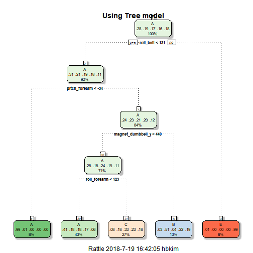
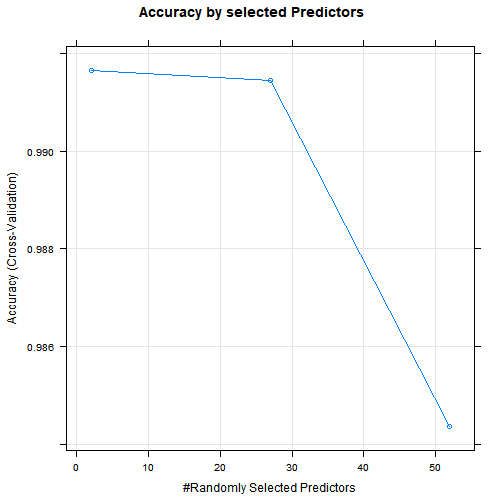

##Synopsis
In this project, our goal will be to use data from accelerometers on the belt, forearm, arm, and dumbell of 6 participants. They were asked to perform barbell lifts correctly and incorrectly in 5 different ways. More information is available from the website here: http://web.archive.org/web/20161224072740/http:/groupware.les.inf.puc-rio.br/har (see the section on the Weight Lifting Exercise Dataset).

##Download data
####data
The training data for this project are available here:  
https://d396qusza40orc.cloudfront.net/predmachlearn/pml-training.csv  
The test data are available here:  
https://d396qusza40orc.cloudfront.net/predmachlearn/pml-testing.csv  


```r
#Before download files, set your working directory.
#Download Train data
download.file("https://d396qusza40orc.cloudfront.net/predmachlearn/pml-training.csv",
              destfile = "pml-training.csv")
#Download test data
download.file("https://d396qusza40orc.cloudfront.net/predmachlearn/pml-testing.csv",
              destfile = "pml-testing.csv")
```

##Preprocessing
Load train, test data from your working directory.

```r
#Load pml-training.csv file
Train <- read.csv("pml-training.csv")
#Load pml-testing.csv file
Test <- read.csv("pml-testing.csv")
```


```r
dim(Train) #check row number and column number
```

```
## [1] 19622   160
```

```r
head(Train[,1:35],4) #limit column number
```

```
##   X user_name raw_timestamp_part_1 raw_timestamp_part_2   cvtd_timestamp
## 1 1  carlitos           1323084231               788290 05/12/2011 11:23
## 2 2  carlitos           1323084231               808298 05/12/2011 11:23
## 3 3  carlitos           1323084231               820366 05/12/2011 11:23
## 4 4  carlitos           1323084232               120339 05/12/2011 11:23
##   new_window num_window roll_belt pitch_belt yaw_belt total_accel_belt
## 1         no         11      1.41       8.07    -94.4                3
## 2         no         11      1.41       8.07    -94.4                3
## 3         no         11      1.42       8.07    -94.4                3
## 4         no         12      1.48       8.05    -94.4                3
##   kurtosis_roll_belt kurtosis_picth_belt kurtosis_yaw_belt
## 1                                                         
## 2                                                         
## 3                                                         
## 4                                                         
##   skewness_roll_belt skewness_roll_belt.1 skewness_yaw_belt max_roll_belt
## 1                                                                      NA
## 2                                                                      NA
## 3                                                                      NA
## 4                                                                      NA
##   max_picth_belt max_yaw_belt min_roll_belt min_pitch_belt min_yaw_belt
## 1             NA                         NA             NA             
## 2             NA                         NA             NA             
## 3             NA                         NA             NA             
## 4             NA                         NA             NA             
##   amplitude_roll_belt amplitude_pitch_belt amplitude_yaw_belt
## 1                  NA                   NA                   
## 2                  NA                   NA                   
## 3                  NA                   NA                   
## 4                  NA                   NA                   
##   var_total_accel_belt avg_roll_belt stddev_roll_belt var_roll_belt
## 1                   NA            NA               NA            NA
## 2                   NA            NA               NA            NA
## 3                   NA            NA               NA            NA
## 4                   NA            NA               NA            NA
##   avg_pitch_belt stddev_pitch_belt var_pitch_belt avg_yaw_belt
## 1             NA                NA             NA           NA
## 2             NA                NA             NA           NA
## 3             NA                NA             NA           NA
## 4             NA                NA             NA           NA
##   stddev_yaw_belt
## 1              NA
## 2              NA
## 3              NA
## 4              NA
```

It seems that some columns have many NA value and blanks. So, I removed columns if they have more than 10000 blanks or 10000 NAs.

```r
index <- vector() #means column number which has more than 10000NAs or blanks.
for(i in 1:ncol(Train)){
  if(sum(is.na(Train[,i])) > 10000 | sum(Train[,i] == "") > 10000){
    index <- c(index,i)
  }
}
ProcessedTrain <- Train[,-index] #remove the columns
#And then, I just need measurements from accelerometers, adjust data for predict model.
ProcessedTrain <- ProcessedTrain[,8:60]
head(ProcessedTrain[,c(1:10,ncol(ProcessedTrain))])
```

```
##   roll_belt pitch_belt yaw_belt total_accel_belt gyros_belt_x gyros_belt_y
## 1      1.41       8.07    -94.4                3         0.00         0.00
## 2      1.41       8.07    -94.4                3         0.02         0.00
## 3      1.42       8.07    -94.4                3         0.00         0.00
## 4      1.48       8.05    -94.4                3         0.02         0.00
## 5      1.48       8.07    -94.4                3         0.02         0.02
## 6      1.45       8.06    -94.4                3         0.02         0.00
##   gyros_belt_z accel_belt_x accel_belt_y accel_belt_z classe
## 1        -0.02          -21            4           22      A
## 2        -0.02          -22            4           22      A
## 3        -0.02          -20            5           23      A
## 4        -0.03          -22            3           21      A
## 5        -0.02          -21            2           24      A
## 6        -0.02          -21            4           21      A
```

And last, before make models, separate data to train set and test set.

```r
library(caret)
inTrain <- createDataPartition(y = ProcessedTrain$classe, p = 0.75)[[1]]
training <- ProcessedTrain[inTrain,]
testing <- ProcessedTrain[-inTrain,]
```

##Modeling
In this project, I used two predict models. First, tree model using rpart, and Second, random forest. We can compare two models and will choose model which has bigger accuracy. Let's make tree model.  

####Use Tree model
In order to limit the effects of overfitting, and improve the efficicency of the models, we will use the cross-validation technique. We will use 5 folds.

```r
library(rattle) #To implement fancyRpartPlot
trCon <- trainControl(method = "cv", number = 5) #fold number is 5
modFit <- train(classe ~., data = training, method = "rpart", trControl = trCon)
fancyRpartPlot(modFit$finalModel, main = "Using Tree model")
```

```
## Warning: Bad 'data' field in model 'call' field.
##          To make this warning go away:
##              Call prp with roundint=FALSE,
##              or rebuild the rpart model with model=TRUE.
```



This model doesn't classify the data to class D. It seems to be a problem. Check tree's accuracy and how it classified.

```r
fitted <- predict(modFit, testing)
confusionMatrix(fitted,testing$classe)$table
```

```
##           Reference
## Prediction    A    B    C    D    E
##          A 1282  411  412  376  147
##          B   24  304   22  151  115
##          C   85  234  421  277  226
##          D    0    0    0    0    0
##          E    4    0    0    0  413
```

```r
confusionMatrix(fitted,testing$classe)$overall
```

```
##       Accuracy          Kappa  AccuracyLower  AccuracyUpper   AccuracyNull 
##   4.934747e-01   3.365209e-01   4.793873e-01   5.075699e-01   2.844617e-01 
## AccuracyPValue  McnemarPValue 
##  9.987181e-209            NaN
```

It shows very low accuracy like coin flips. How about using Random forest?
####Use Random forest model

```r
modFit.rf <- train(classe ~., data = training, method = "rf", trControl = trCon, verbose = FALSE)
plot(modFit.rf, main = "Accuracy by selected Predictors")
```



```r
#predict using test set
fitted.rf <- predict(modFit.rf, testing)
#check contingency table and accuracy
confusionMatrix(fitted.rf, testing$classe)
```

```
## Confusion Matrix and Statistics
## 
##           Reference
## Prediction    A    B    C    D    E
##          A 1393    8    0    0    0
##          B    2  939    8    0    0
##          C    0    2  846   15    0
##          D    0    0    1  785    1
##          E    0    0    0    4  900
## 
## Overall Statistics
##                                          
##                Accuracy : 0.9916         
##                  95% CI : (0.9887, 0.994)
##     No Information Rate : 0.2845         
##     P-Value [Acc > NIR] : < 2.2e-16      
##                                          
##                   Kappa : 0.9894         
##  Mcnemar's Test P-Value : NA             
## 
## Statistics by Class:
## 
##                      Class: A Class: B Class: C Class: D Class: E
## Sensitivity            0.9986   0.9895   0.9895   0.9764   0.9989
## Specificity            0.9977   0.9975   0.9958   0.9995   0.9990
## Pos Pred Value         0.9943   0.9895   0.9803   0.9975   0.9956
## Neg Pred Value         0.9994   0.9975   0.9978   0.9954   0.9998
## Prevalence             0.2845   0.1935   0.1743   0.1639   0.1837
## Detection Rate         0.2841   0.1915   0.1725   0.1601   0.1835
## Detection Prevalence   0.2857   0.1935   0.1760   0.1605   0.1843
## Balanced Accuracy      0.9981   0.9935   0.9926   0.9879   0.9989
```

Random Forest model shows very high accuracy 0.9931. So I choosed this model, and predict classe of our test set's participants.

##Prediction
####Preprocessing Test data

```r
ProcessedTest <- Test[,-index]
ProcessedTest <- ProcessedTest[,8:60]
```

####Predict

```r
Result <- predict(modFit.rf, ProcessedTest)
Result
```

```
##  [1] B A B A A E D B A A B C B A E E A B B B
## Levels: A B C D E
```
